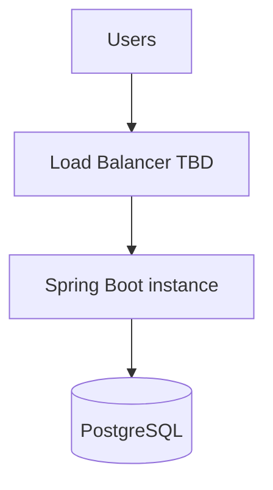

# Deployment View

```mermaid
flowchart TB
  U[Users] --> LB[Load Balancer TBD]
  LB --> APP1[Spring Boot instance]
  APP1 --> PG[(PostgreSQL)]
```

Single-node localhost AS-IS; horizontal scale TO-BE.
